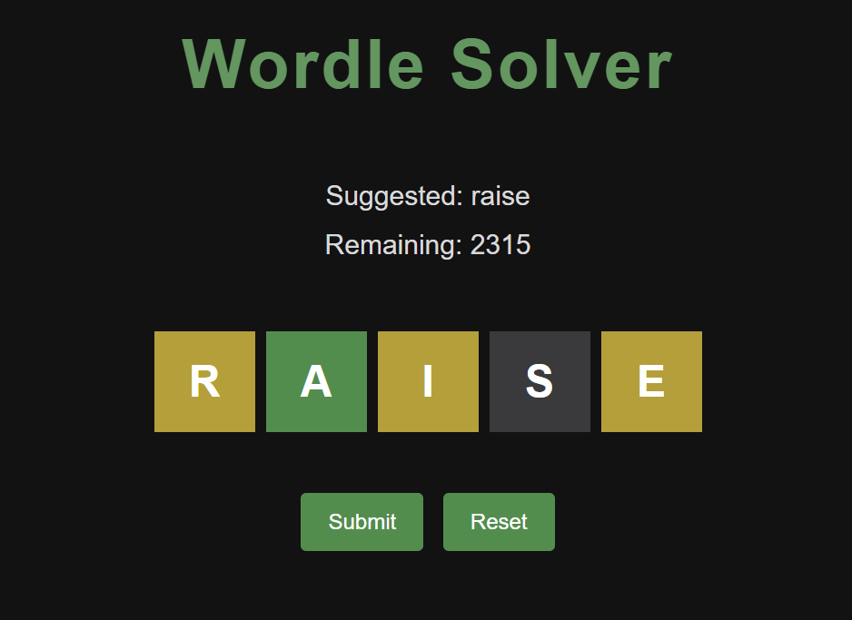

# Wordle Solver



This is a Wordle Solver based on information throry that uses [Shannon Entropy](https://en.wikipedia.org/wiki/Entropy_(information_theory)) to suggest the optimal guess word in Wordle. It was built in C++ and then compiled to WebAssembly using [Emscripten](https://emscripten.org/), hence working entirely in the browser without any backend.

## How it Works

For each guess, the solver computes the expected information gain (in bits) across all remaining candidate words. Next, it selects the word that maximally partitions the remaining possible words. In other words, it selects the word that, on average, eliminates the most possibilities regardless of the outcome.

The core metric in this case is Shannon Entropy:


```math
H = -\sum p(x)\log_2 p(x)
```

where each outcome x is a possible colour pattern (gray/green/yellow), p(x) being the probability of obtaining that pattern based on the frequency of possible patterns.

Check out this video by 3Blue1Brown on ["Solving Wordle using information theory"](https://www.youtube.com/watch?v=v68zYyaEmEA).

## Usage

1. Start a Wordle game at [https://wordlegame.org/](https://wordlegame.org/)
2. Open the solver at [m-j-r-q.github.io/Wordle-Solver](https://m-j-r-q.github.io/Wordle-Solver/)
3. Enter the solver's suggested word into Wordle Solver.
4. Type your guess and toggle through the color pattern by clicking on each tile:
   - G = Green (correct position)
   - Y = Yellow (wrong position)
   - B = Black/Gray (not in word)
5. Click the "Submit" button to get the next suggestion.
6. Click the "Reset" button to reset the game, and play again.

## Tech stack

- **C++**: Used for the solving logic, pattern computation and the entropy calculation
- **WebAssembly**: This was compiled via Emscripten, and runs in the browser
- **JavaScript**: Used for the game loop and UI
- **GitHub Pages**: Static hosting of the Solver

## Building locally

Install [Emscripten](https://emscripten.org/docs/getting_started/downloads.html), then:

```bash
emcc src/solver.cpp \
  -o web/solver.js \
  --embed-file src/words_1.txt@words_1.txt \
  -lembind \
  -s WASM=1 \
  -s ALLOW_MEMORY_GROWTH=1 \
  -O2
```

Serve the `web/` folder with a local server:

```bash
python3 -m http.server 8000
```

Then open `http://localhost:8000`.

## Running the Solver Locally in C++

A standalone terminal version of the solver can also be built and executed directly using `main.cpp`, without WebAssembly or the browser frontend.

### Compile

Using `g++`:

```bash
g++ src/main.cpp -O2 -std=c++17 -o wordle_solver
```

### Run

```bash
./wordle_solver
```

### Example Session

```text
Try the word: raise
What is your guess: raise
What is your pattern (e.g GYBYG): BGYBB
Try the word: ....
```

### Pattern Format

Each letter in the pattern corresponds to a tile result in Wordle:

| Character | Meaning |
|---|---|
| G | Correct letter, correct position |
| Y | Correct letter, wrong position |
| B | Letter not present |


Example:

```text
BGYBB
```

means:
- letter 1 → gray
- letter 2 → green
- letter 3 → yellow 
- letters 4–5 → gray
